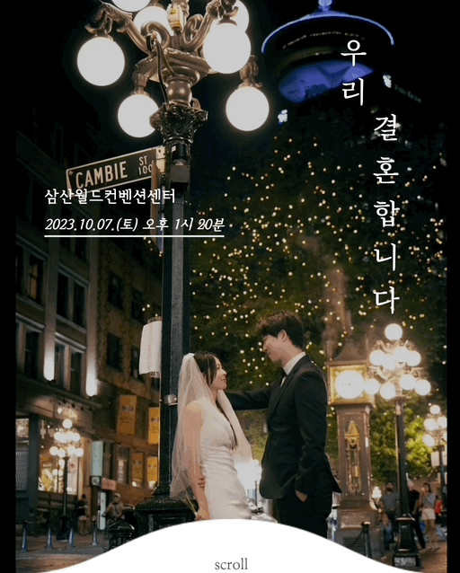
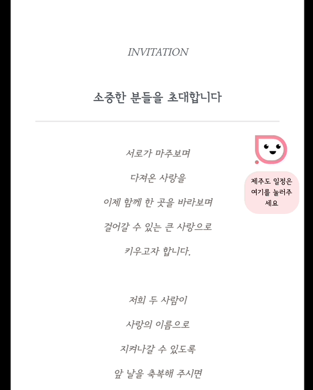
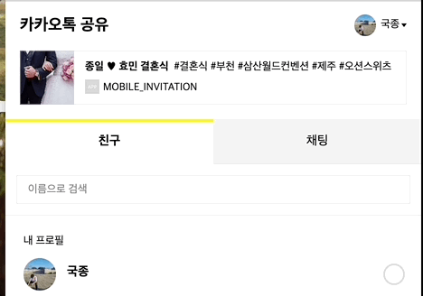

# Mobile Invitation

### 종일 🎔 효민 결혼식에 초청합니다

https://wedding-oct.vercel.app/

친형의 결혼식 선물로 작업하게 된 모바일 청첩장입니다.
최대한 정성스럽고, 깔끔하게 만들고자 노력했습니다.

(만약, 저처럼 선물로 작업하시는 경우 제가 작업한 기능이 도움이 된다면 이미지를 제외한 나머지는, 얼마든지 가져다가 사용하셔도 좋습니다 😊)

# Main Stacks

작업 스텍입니다.

-   Nextjs
-   TypeScript
-   TailwindCSS

# FEAT

모바일 청첩장을 만들면서 사용했던 기능들입니다.
<br>

-   AOS
-   date-fns
-   react-Clipboard
-   Naver-Map-Api
-   Modal, Framer-Motion
-   KakaoShare

# GIF

모바일 청첩장

### 메인 화면

<br>

<br>

### 초대장 & 달력

<br>

<br>

### 정보 & 포토갤러리

<br>

<br>

### 카카오톡 공유

<br>

<br>

# Font

사용했던 폰트에 대한 정보 공유입니다.
(나눔명조는 웹뷰와 모바일에서 차이가 있었습니다)

```css
@font-face {
    font-family: 'SunBatang-Light';
    src: url('https://cdn.jsdelivr.net/gh/projectnoonnu/noonfonts_eight@1.0/SunBatang-Light.woff')
        format('woff');
    font-weight: normal;
    font-style: normal;
}

@import url(//fonts.googleapis.com/earlyaccess/nanummyeongjo.css);

.nanummyeongjo * {
    font-family: 'Nanum Myeongjo', serif;
}

@font-face {
    font-family: 'Arita-buri-SemiBold';
    src: url('https://cdn.jsdelivr.net/gh/projectnoonnu/noonfonts_one@1.0/Arita-buri-SemiBold.woff')
        format('woff');
    font-weight: normal;
    font-style: normal;
}

@font-face {
    font-family: 'SUITE-Regular';
    src: url('https://cdn.jsdelivr.net/gh/projectnoonnu/noonfonts_2304-2@1.0/SUITE-Regular.woff2')
        format('woff2');
    font-weight: 600;
    font-style: semibold;
}

@font-face {
    font-family: 'KOTRAHOPE';
    src: url('https://cdn.jsdelivr.net/gh/projectnoonnu/noonfonts_2110@1.0/KOTRAHOPE.woff2')
        format('woff2');
    font-weight: normal;
    font-style: normal;
}

@font-face {
    font-family: 'SeoulHangangM';
    src: url('https://cdn.jsdelivr.net/gh/projectnoonnu/noonfonts_two@1.0/SeoulHangangM.woff')
        format('woff');
    font-weight: normal;
    font-style: normal;
}
```

# Notes

작업 시, 마주했던 경험들을 기록한 개인 노트입니다.
📝 Notion : https://huchu.link/TZVaiM4
<br>

-   작업 시, 발생했던 에러와 해결 방법
-   라이브러리 사용법
-   하드코딩했던 부분들 인터렉션 설명

# 후기

처음에, 레이아웃을 공통적으로 활용할 줄 모르고 Atomic Design 형태로
기능구조를 분배했는데 작업 막바지에 제주도 일정이 추가되면서 기능 구조의 중복이 생겼습니다. 시간 관계 상 빌드 후, 작업트리를 디벨롭하고자 합니다.
